Kv260-Pmod-gpio-emio
=======================================================================

Introduction
------------------------------------------------------------------------------------

### Overview

This Repository provides examples for pmod-gpio(with emio) and ZynqMP-FPGA-Linux.

### Scope

### Scope

The KV260 features a 12-pin connector compliant with the Pmod interface standard.
This Pmod connector is connected to the Programmable Logic (PL) side of the ZynqMP device on the KV260.

When using the KV260's Pmod connector as Type1A (expanded GPIO), methods exist such as preparing AXI-GPIO or custom IP on the PL side. However, this article introduces a method connecting from the GPIO controller on the PS (Processing System) side to the PL side via EMIO. The advantages of using the PS-side GPIO are as follows:

  * Only a few wiring resources are required on the PL side.
  * Since no IP resides on the PL side, there is no need to prepare new Device Trees or Kernel Drivers for it.

### Block Diagram


### Requirement

* Board: any of the following
  - Kv260
* OS: any of the following
  - https://github.com/ikwzm/ZynqMP-FPGA-Debian13
  
### Licensing

Distributed under the BSD 2-Clause License.

Usage
------------------------------------------------------------------------------------

### Download Kv260-Pmod-gpio-emio

```console
shell$ git clone --depth 1 --recursive https://github.com/ikwzm/Kv260-Pmod-gpio-emio
shell$ cd Kv260-Pmod-gpio-emio
```

### Program Bitstream file to PL

#### Copy Bitstream file to /lib/firmsare

```console
shell$ sudo sh -c 'gzip -d -c kv260-pmod-gpio-emio.bin.gz > /lib/firmware/kv260-pmod-gpio-emio.bin'
```

#### Compile kv260-pmod-gpio-emio.dts

```console
shell$ dtc -I dts -O dtb -o kv260-pmod-gpio-emio.dtb kv260-pmod-gpio-emio.dts
```

#### Apply dtb(device tree overlay blob)

```console
shell$ sudo mkdir /config/device-tree/overlays/kv260-pmod-gpio-emio
shell$ sudo cp kv260-pmod-gpio-emio.dtb /config/device-tree/overlays/kv260-pmod-gpio-emio/dtbo
```

### Example with gpiod

In Debian 13, GPIO control uses libgpiod (the gpiod command) as the standard method.
(The old /sys/class/gpio (sysfs GPIO) is deprecated.)

#### Install gpiod

```console
shell$ sudo apt install gpiod
```
#### Checking the GPIO Controller and Pins

Use the gpioinfo command to check the GPIO controller and pins.

<details><summary>gpioinfo output</summary><div>

```console
shell$ sudo gpioinfo
gpiochip0 - 4 lines:
        line   0:       unnamed                 input
        line   1:       unnamed                 output active-low consumer=reset
        line   2:       unnamed                 input
        line   3:       unnamed                 input
gpiochip1 - 174 lines:
        line   0:       "QSPI_CLK"              input
        line   1:       "QSPI_DQ1"              input
        line   2:       "QSPI_DQ2"              input
        line   3:       "QSPI_DQ3"              input
        line   4:       "QSPI_DQ0"              input
        line   5:       "QSPI_CS_B"             input
        line   6:       "SPI_CLK"               input
        line   7:       "LED1"                  output consumer="heartbeat"
        line   8:       "LED2"                  output consumer="vbus_det"
        line   9:       "SPI_CS_B"              input
        line  10:       "SPI_MISO"              input
        line  11:       "SPI_MOSI"              input
        line  12:       "FWUEN"                 input active-low consumer="fwuen"
        line  13:       "EMMC_DAT0"             input
        line  14:       "EMMC_DAT1"             input
        line  15:       "EMMC_DAT2"             input
        line  16:       "EMMC_DAT3"             input
        line  17:       "EMMC_DAT4"             input
        line  18:       "EMMC_DAT5"             input
        line  19:       "EMMC_DAT6"             input
        line  20:       "EMMC_DAT7"             input
        line  21:       "EMMC_CMD"              input
        line  22:       "EMMC_CLK"              input
        line  23:       "EMMC_RST"              input
        line  24:       "I2C1_SCL"              output drive=open-drain consumer="scl"
        line  25:       "I2C1_SDA"              input drive=open-drain consumer="sda"
        line  26:       unnamed                 input
        line  27:       unnamed                 input
        line  28:       unnamed                 input
        line  29:       unnamed                 input
        line  30:       unnamed                 input
        line  31:       unnamed                 input
        line  32:       unnamed                 input
        line  33:       unnamed                 input
        line  34:       unnamed                 input
        line  35:       unnamed                 input
        line  36:       unnamed                 input
        line  37:       unnamed                 input
        line  38:       unnamed                 output active-low consumer=PHY reset
        line  39:       unnamed                 input
        line  40:       unnamed                 input
        line  41:       unnamed                 input
        line  42:       unnamed                 input
        line  43:       unnamed                 input
        line  44:       unnamed                 output active-low consumer=reset
        line  45:       unnamed                 input
        line  46:       unnamed                 input
        line  47:       unnamed                 input
        line  48:       unnamed                 input
        line  49:       unnamed                 input
        line  50:       unnamed                 input
        line  51:       unnamed                 input
        line  52:       unnamed                 input
        line  53:       unnamed                 input
        line  54:       unnamed                 input
        line  55:       unnamed                 input
        line  56:       unnamed                 input
        line  57:       unnamed                 input
        line  58:       unnamed                 input
        line  59:       unnamed                 input
        line  60:       unnamed                 input
        line  61:       unnamed                 input
        line  62:       unnamed                 input
        line  63:       unnamed                 input
        line  64:       unnamed                 input
        line  65:       unnamed                 input
        line  66:       unnamed                 input
        line  67:       unnamed                 input
        line  68:       unnamed                 input
        line  69:       unnamed                 input
        line  70:       unnamed                 input
        line  71:       unnamed                 input
        line  72:       unnamed                 input
        line  73:       unnamed                 input
        line  74:       unnamed                 input
        line  75:       unnamed                 input
        line  76:       unnamed                 input
        line  77:       unnamed                 input
        line  78:       unnamed                 input
        line  79:       unnamed                 input
        line  80:       unnamed                 input
        line  81:       unnamed                 input
        line  82:       unnamed                 input
        line  83:       unnamed                 input
        line  84:       unnamed                 input
        line  85:       unnamed                 input
        line  86:       unnamed                 input
        line  87:       unnamed                 input
        line  88:       unnamed                 input
        line  89:       unnamed                 input
        line  90:       unnamed                 input
        line  91:       unnamed                 input
        line  92:       unnamed                 input
        line  93:       unnamed                 input
        line  94:       unnamed                 input
        line  95:       unnamed                 input
        line  96:       unnamed                 input
        line  97:       unnamed                 input
        line  98:       unnamed                 input
        line  99:       unnamed                 input
        line 100:       unnamed                 input
        line 101:       unnamed                 input
        line 102:       unnamed                 input
        line 103:       unnamed                 input
        line 104:       unnamed                 input
        line 105:       unnamed                 input
        line 106:       unnamed                 input
        line 107:       unnamed                 input
        line 108:       unnamed                 input
        line 109:       unnamed                 input
        line 110:       unnamed                 input
        line 111:       unnamed                 input
        line 112:       unnamed                 input
        line 113:       unnamed                 input
        line 114:       unnamed                 input
        line 115:       unnamed                 input
        line 116:       unnamed                 input
        line 117:       unnamed                 input
        line 118:       unnamed                 input
        line 119:       unnamed                 input
        line 120:       unnamed                 input
        line 121:       unnamed                 input
        line 122:       unnamed                 input
        line 123:       unnamed                 input
        line 124:       unnamed                 input
        line 125:       unnamed                 input
        line 126:       unnamed                 input
        line 127:       unnamed                 input
        line 128:       unnamed                 input
        line 129:       unnamed                 input
        line 130:       unnamed                 input
        line 131:       unnamed                 input
        line 132:       unnamed                 input
        line 133:       unnamed                 input
        line 134:       unnamed                 input
        line 135:       unnamed                 input
        line 136:       unnamed                 input
        line 137:       unnamed                 input
        line 138:       unnamed                 input
        line 139:       unnamed                 input
        line 140:       unnamed                 input
        line 141:       unnamed                 input
        line 142:       unnamed                 input
        line 143:       unnamed                 input
        line 144:       unnamed                 input
        line 145:       unnamed                 input
        line 146:       unnamed                 input
        line 147:       unnamed                 input
        line 148:       unnamed                 input
        line 149:       unnamed                 input
        line 150:       unnamed                 input
        line 151:       unnamed                 input
        line 152:       unnamed                 input
        line 153:       unnamed                 input
        line 154:       unnamed                 input
        line 155:       unnamed                 input
        line 156:       unnamed                 input
        line 157:       unnamed                 input
        line 158:       unnamed                 input
        line 159:       unnamed                 input
        line 160:       unnamed                 input
        line 161:       unnamed                 input
        line 162:       unnamed                 input
        line 163:       unnamed                 input
        line 164:       unnamed                 input
        line 165:       unnamed                 input
        line 166:       unnamed                 input
        line 167:       unnamed                 input
        line 168:       unnamed                 input
        line 169:       unnamed                 input
        line 170:       unnamed                 input
        line 171:       unnamed                 input
        line 172:       unnamed                 input
        line 173:       unnamed                 input
```

</div></details>

#### Line and Pmod pin assignment

| line | GPIO(EMIO) | Pmod Name | Pmod Pin |
|:----:|:----------:|:---------:|:--------:|
|  78  |  0         | S1A       | 1        |
|  79  |  1         | S2A       | 3        |
|  80  |  2         | S3A       | 5        |
|  81  |  3         | S4A       | 7        |
|  82  |  4         | S1B       | 2        |
|  83  |  5         | S2B       | 4        |
|  84  |  6         | S3B       | 6        |
|  85  |  7         | S4B       | 8        |

#### Output 0 to S1A for 2 sec

```console
shell$ sudo gpioset -c gpiochip1 -t2s,0 78=0
```

### Example with python3-libgpiod

#### Install python3-libgpiod

```console
shell$ sudo apt install python3-libgpiod
```

#### Output 0 to S1A for 2 sec

<details><summary>pmod-ledx8-sample.py</summary><div>

```python:pmod-ledx8-sample.py
import gpiod
import time

class PmodLEDx8:
    def __init__(self, chip_path, lo, hi):
        self.line_settings = gpiod.LineSettings(
            direction    = gpiod.line.Direction.OUTPUT,
            output_value = gpiod.line.Value.INACTIVE,
            active_low   = True
        )
        self.line_low    = lo
        self.line_high   = hi
        self.line_config = {i: self.line_settings for i in range(lo,hi)}
        self.lines       = gpiod.request_lines(
            chip_path,
            consumer     = "pmod-ledx8",
            config       = self.line_config
        )

    def set_value(self, line, value):
        if value == 0:
            self.lines.set_value(line+self.line_low, gpiod.line.Value.INACTIVE)
        else:
            self.lines.set_value(line+self.line_low, gpiod.line.Value.ACTIVE)
            
        
if __name__ == '__main__':
    pmod_led = PmodLEDx8('/dev/gpiochip1', 78, 85)
    pmod_led.set_value(0,1)
    time.sleep(2)
    pmod_led.set_value(0,0)

```

</div></details>

```console
shell$ sudo python3 pmod-ledx8-sample.py
```

Build Bitstream file
------------------------------------------------------------------------------------

### Requirement

* Xilinx Vivado 2025.1 or 2025.1.1

### Download Kv260-Pmod-gpio-emio

```console
shell$ git clone --depth 1 --recursive https://github.com/ikwzm/Kv260-Pmod-gpio-emio
shell$ cd Kv260-Pmod-gpio-emio
```

### Using the Vivado GUI

#### Create Project

<details><summary>Vivado > File > Project New</summary><div>

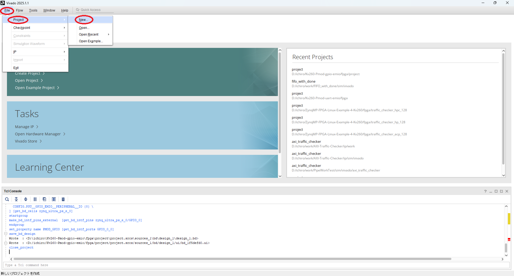

</div></details>

<details><summary>New Project > Create a New Vivado Project - Select "Next"</summary><div>

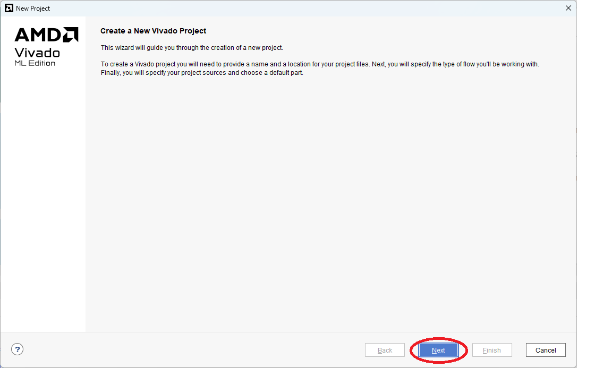

</div></details>

<details><summary>New Project > Project Name - Set Project Name and location</summary><div>

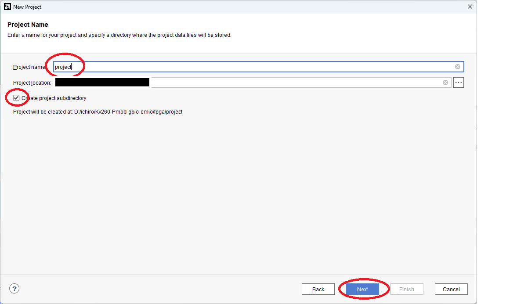

</div></details>

<details><summary>New Project > Project Type - Select "RTL Project"</summary><div>

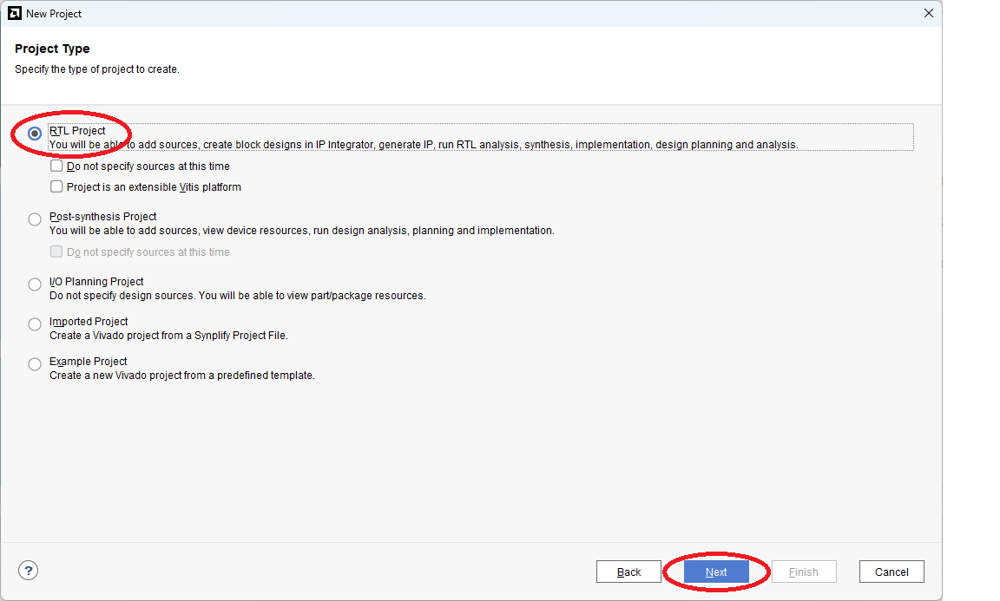

</div></details>

<details><summary>New Project > Add Sources - It is fine to leave the space blank</summary><div>

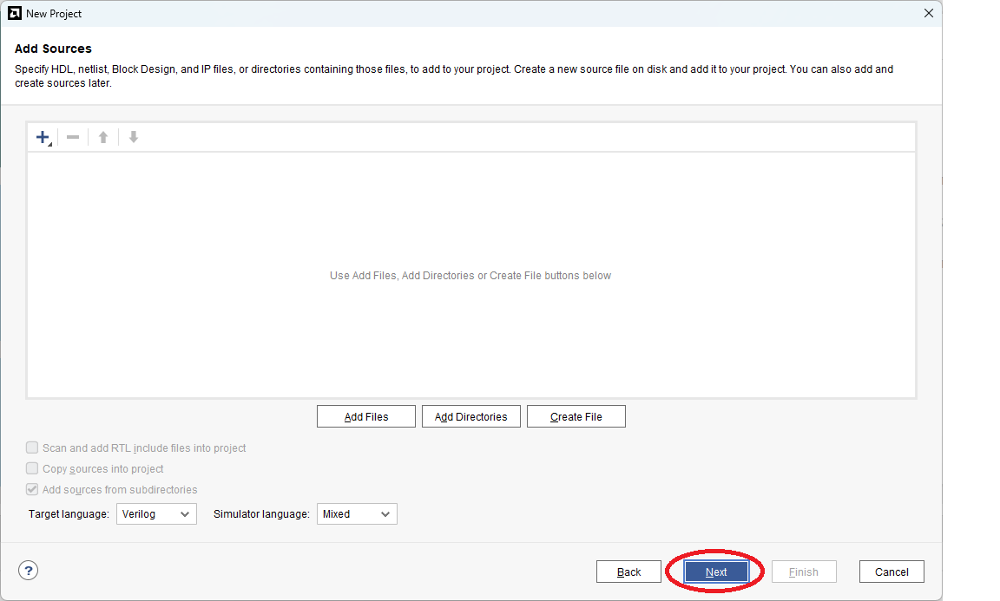

</div></details>

<details><summary>New Project > Add Constraints - I'll add it later, but for now it's fine to leave it blank</summary><div>


</div></details>

<details><summary>New Project > Default Part - Boards > Select "Kria KV260 Vision AI Starter Kit SOM"</summary><div>

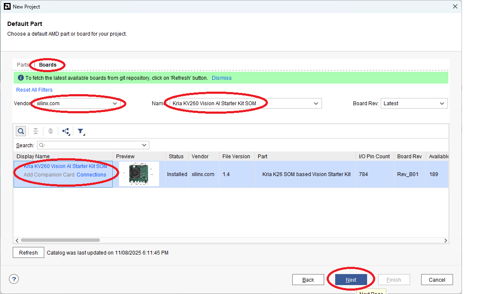

</div></details>

<details><summary>New Project > New Project Summary - Finally, select "Finish"</summary><div>

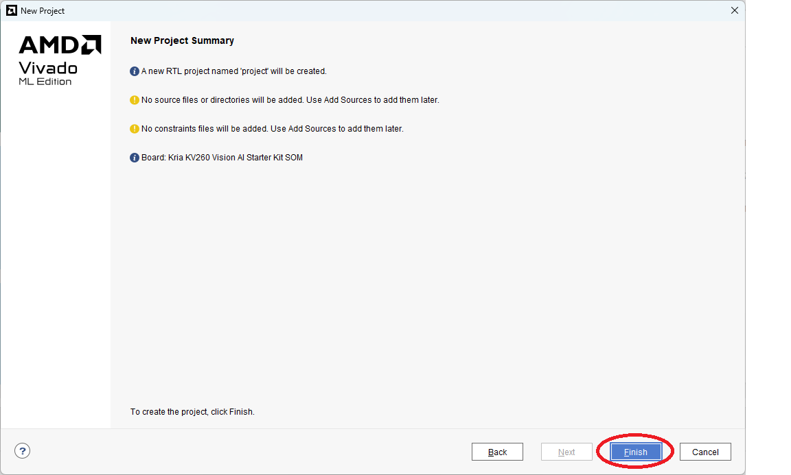

</div></details>

#### Create Block Design

Open the Project and select Create Block Design.   
Set the Design name to something appropriate (here, the default value design_1).

##### Add ZynqMP

<details><summary>Click the “+” icon and select “Zynq Ultrascale+ MPSoC”</summary><div>

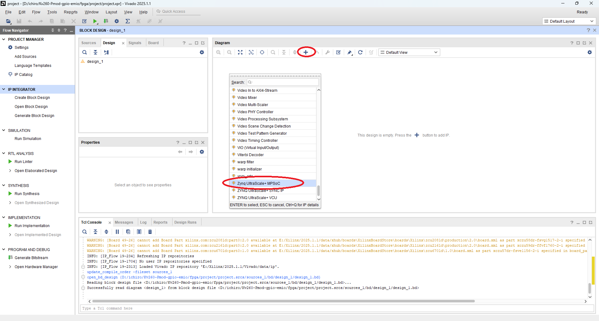

</div></details>

<details><summary>Click "Run Block Automation" to preset various ZynqMP configurations for  KV260</summary><div>

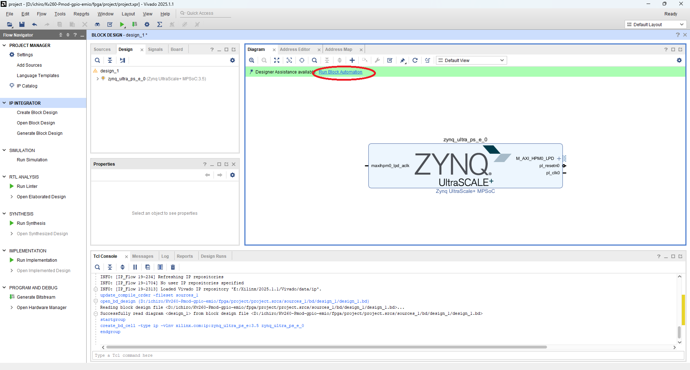

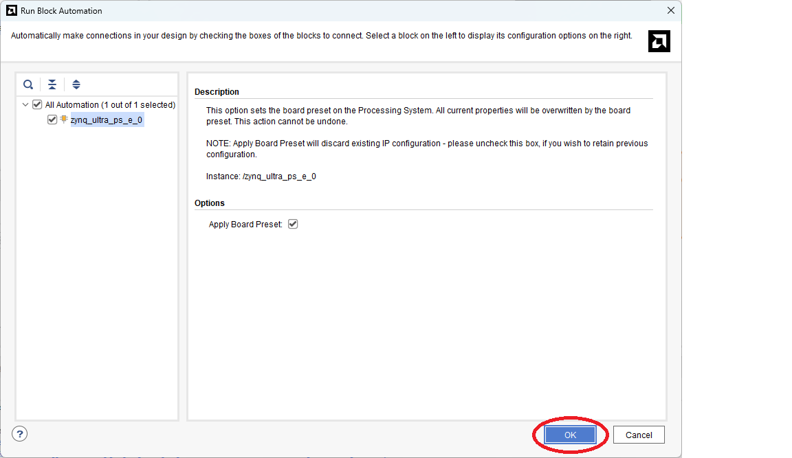

</div></details>

The ZynqMP has now been initialized (preset) for the KV260.

##### Re-customize ZynqMP

<details><summary>Select “Block Properties” for the “Zynq Ultrascale+ MPSoC” to open Re-customize IP</summary><div>

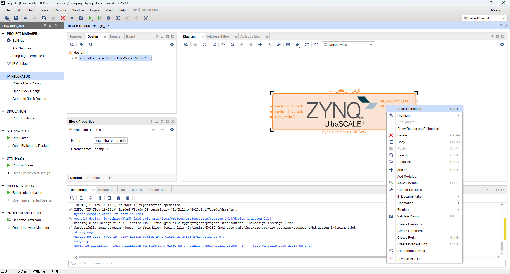

</div></details>

When the ZynqMP is initialized (preset) for the KV260, how many of the PS-PL interfaces are enabled.
Therefore, disable any interfaces that are not needed as necessary.

For now, all interfaces are disabled here.

<details><summary>Re-customize IP > PS-PL Configureation</summary><div>

 * General > Interrupts > Set PL to PS “IRQ0[0-7]” to 0.
 * Uncheck the Fabric Reset Enable checkbox to disable the Reset output.
 * PS-PL Interfaces > Master Interfaces > Uncheck the “AXI HCPM0 FPD” and “AXI HPM1 FPD” checkboxes to disable these interfaces.


</div></details>

<details><summary>Re-customize IP > Clock Configureation</summary><div>

 * Clock Configuration > Output Clocks > PL Fabric Clocks, uncheck the PL0 and PL1 checkboxes to disable these clock outputs.

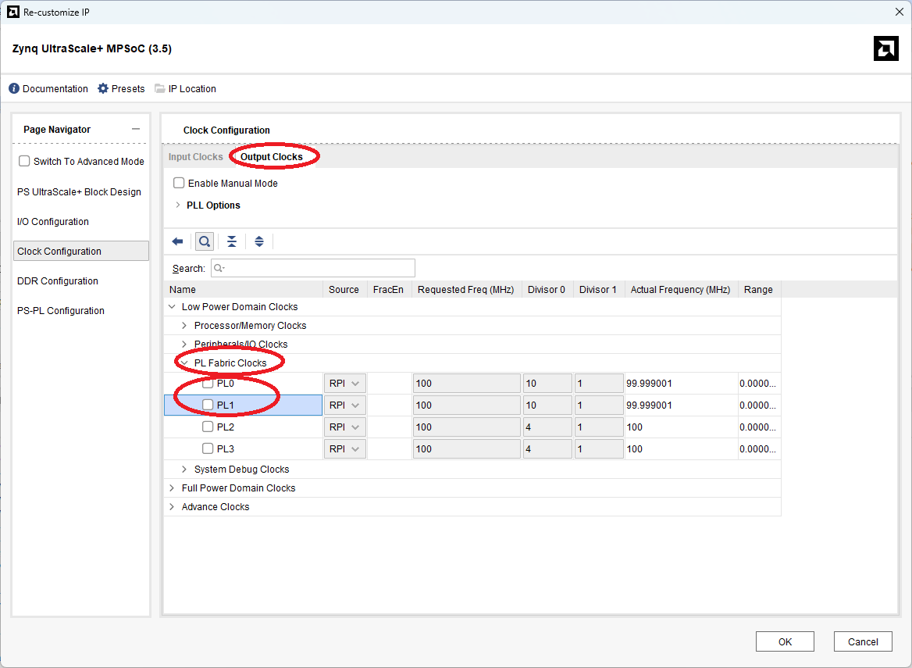

</div></details>

Finally, enable the EMIO on the GPIO.

<details><summary>Re-customize IP > I/O Configuration > GPIO > GPIO EMIO</summary><div>

Specifically, check the “GPIO EMIO” checkbox under I/O Configuration > Low Speed > I/O Peripherals > GPIO, and set the number of GPIO EMIO pins to use.

Here, we have set it to 8 pins to match the Pmod expanded GPIO.

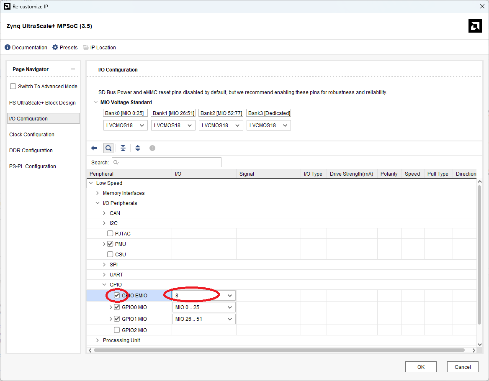

</div></details>

##### Adding and Connecting External Pins

Next, connect to the GPIO EMIO external pins. Here, we'll use the relatively simple “Make External” command.

<details><summary>GPIO_0 > Make External</summary><div>


</div></details>

The “Make External” command assigns an arbitrary external port name (here, “GPIO_0_0”).   
Change the port name as needed.   
To do so, modify the value in the Name: field of the External Interface Properties.   
Here, it has been changed to PMOD_GPIO.   
This name will be used later when assigning pins in the constellation file.   

<details><summary>External Interface Properties > Name:</summary><div>

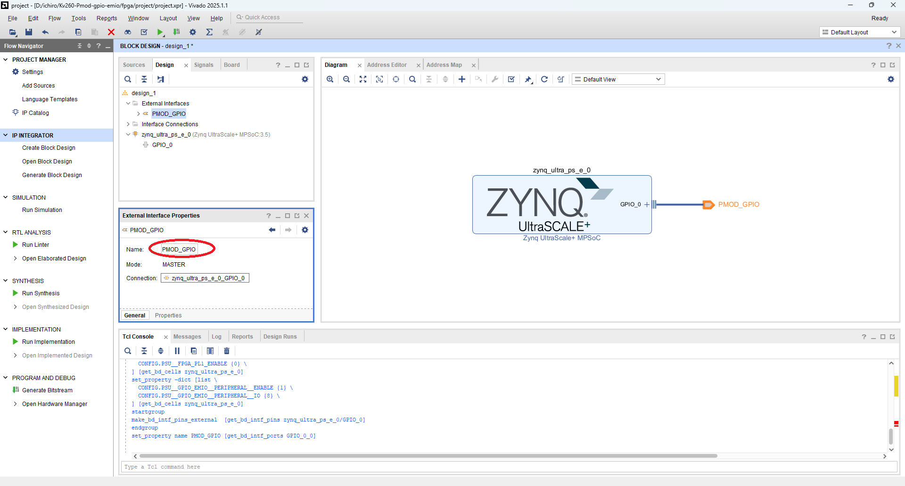

</div></details>

##### Supplement (FAN control)

Since limiting it to Pmod control alone would be wasteful, we also output the signal for FAN control to an external port.
For details on the KV260's FAN control, please refer to the following article(Japanese language).

  * ["Controlling the Cooling Fan with KV260 on Debian/Ubuntu (Part 1)" @Qiita](https://qiita.com/ikwzm/items/345184df3a7abd6b4a26)

#### Add Constraints File

Add a constraints file describing pin assignments and other details. This file will be described later.

Specifically, specify the files to add via PROJECT MANAGER > Add Sources > Add or Create Constraints.

<details><summary>PROJECT MANAGER > Add Sources > Add or Create Constraints</summary><div>

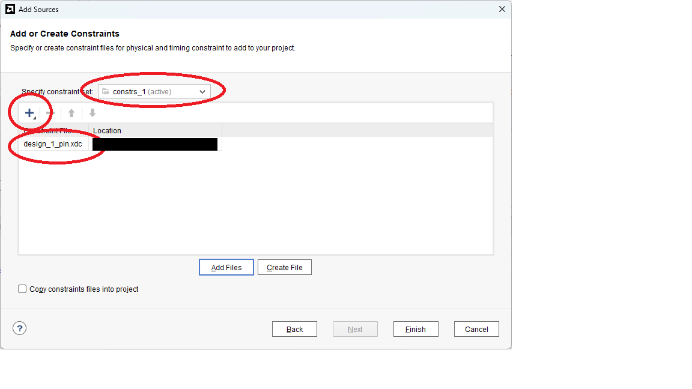

</div></details>

#### Create Wrapper File

Generates wrapper file for use in implementation (logic synthesis and placement and routing).

Specifically, select IP INTEGRATOR > Sources > design_1(design_1.bd) > Create HDL Wrapper...

<details><summary>IP INTEGRATOR > Sources > design_1(design_1.bd) > Create HDL Wrapper...</summary><div>

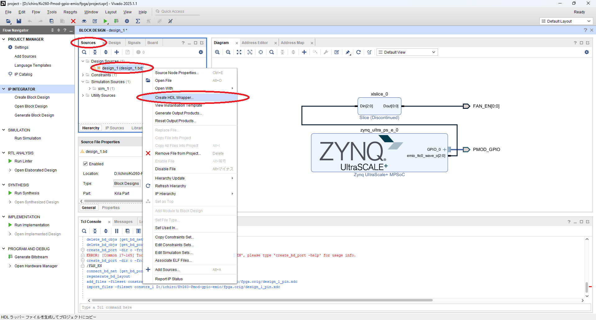

</div></details>

#### Generate Bitstream File

Select PROGRAM AND DEBUG > Generate Bitstream to generate the bitstream file.


### Using the Vivado CUI(Tcl)

#### Create Project

We create the project using the following Tcl script.

<details><summary>fpga/create_project.tcl(full text)</summary><div>

```Tcl:fpga/create_project.tcl
#
# create_project.tcl  Tcl script for creating project
#

set project_directory       [file dirname [info script]]
set project_name            "project"
set board_part              [get_board_parts -quiet -latest_file_version "*kv260*"]
lappend constrs_file_list   [file join $project_directory "design_1_pin.xdc" ]
set design_bd_tcl_file      [file join $project_directory "design_1_bd.tcl"  ]
#
# Create project
#
if {[info exists project_name     ] == 0} {
    set project_name        "project"
}
if {[info exists project_directory] == 0} {
    set project_directory   [pwd]
}
cd $project_directory
create_project -force $project_name $project_directory
#
# Set project properties
#
if       {[info exists board_part ] && [string equal $board_part  "" ] == 0} {
    set_property "board_part"     $board_part      [current_project]
} elseif {[info exists device_part] && [string equal $device_part "" ] == 0} {
    set_property "part"           $device_part     [current_project]
} else {
    puts "ERROR: Please set board_part or device_part."
    return 1
}
set_property "default_lib"        "xil_defaultlib" [current_project]
set_property "simulator_language" "Mixed"          [current_project]
set_property "target_language"    "VHDL"           [current_project]
#
# Create fileset "sources_1"
#
if {[string equal [get_filesets -quiet sources_1] ""]} {
    create_fileset -srcset sources_1
}
#
# Create fileset "constrs_1"
#
if {[string equal [get_filesets -quiet constrs_1] ""]} {
    create_fileset -constrset constrs_1
}
#
# Create fileset "sim_1"
#
if {[string equal [get_filesets -quiet sim_1] ""]} {
    create_fileset -simset sim_1
}
#
# Create run "synth_1" and set property
#
set synth_1_flow     "Vivado Synthesis 2020"
set synth_1_strategy "Vivado Synthesis Defaults"
if {[string equal [get_runs -quiet synth_1] ""]} {
    create_run -name synth_1 -flow $synth_1_flow -strategy $synth_1_strategy -constrset constrs_1
} else {
    set_property flow     $synth_1_flow     [get_runs synth_1]
    set_property strategy $synth_1_strategy [get_runs synth_1]
}
current_run -synthesis [get_runs synth_1]
#
# Create run "impl_1" and set property
#
set impl_1_flow      "Vivado Implementation 2020"
set impl_1_strategy  "Vivado Implementation Defaults"
if {[string equal [get_runs -quiet impl_1] ""]} {
    create_run -name impl_1 -flow $impl_1_flow -strategy $impl_1_strategy -constrset constrs_1 -parent_run synth_1
} else {
    set_property flow     $impl_1_flow      [get_runs impl_1]
    set_property strategy $impl_1_strategy  [get_runs impl_1]
}
current_run -implementation [get_runs impl_1]
#
# Set IP Repository
#
if {[info exists ip_repo_path_list] && [llength $ip_repo_path_list] > 0 } {
    set_property ip_repo_paths $ip_repo_path_list [current_fileset]
    update_ip_catalog
}
#
# Create block design
#
if {[info exists design_bd_tcl_file]} {
    # 
    # Read block design file
    #
    source $design_bd_tcl_file
    #
    # Save block design
    #
    regenerate_bd_layout
    save_bd_design
    #
    # Generate wrapper files
    #
    set design_bd_name  [get_bd_designs]
    make_wrapper -files [get_files $design_bd_name.bd] -top -import
}
#
# Import pin files
#
if {[info exists constrs_file_list] && [llength $constrs_file_list] > 0 } {
    add_files    -fileset constrs_1 -norecurse $constrs_file_list
}
```

</div></details>

Run fpga/create_project.tcl as follows to create the project and generate the block design.

```
Vivado > Tools > Run Tcl Script... > fpga/create_project.tcl
```

Below is an explanation of part of fpga/create_project.tcl.

<details><summary>fpga/create_project.tcl(excerpt 1) - Boards Property Configuration</summary><div>

KV260 is specified as the property indicating the board in the following location.

```Tcl:fpga/create_project.tcl(excerpt 1)
  :
set board_part              [get_board_parts -quiet -latest_file_version "*kv260*"]
  :
if       {[info exists board_part ] && [string equal $board_part  "" ] == 0} {
    set_property "board_part"     $board_part      [current_project]
} elseif {[info exists device_part] && [string equal $device_part "" ] == 0} {
    set_property "part"           $device_part     [current_project]
} else {
    puts "ERROR: Please set board_part or device_part."
    return 1
}
  :
```

</div></details>

<details><summary>fpga/create_project.tcl(excerpt 2) - Load Block Design File</summary><div>

Load the block design file (design_1_bd.tcl). This file will be discussed later.

```Tcl:fpga/create_project.tcl(excerpt 2)
  :
set design_bd_tcl_file      [file join $project_directory "design_1_bd.tcl"  ]
  :
if {[info exists design_bd_tcl_file]} {
    # 
    # Read block design file
    #
    source $design_bd_tcl_file
    #
    # Save block design
    #
    regenerate_bd_layout
    save_bd_design
    #
    # Generate wrapper files
    #
    set design_bd_name  [get_bd_designs]
    make_wrapper -files [get_files $design_bd_name.bd] -top -import
}
  :
```

</div></details>

<details><summary>fpga/create_project.tcl(excerpt 3) - Add Constraints File</summary><div>

Add a constraints file describing pin assignments and other details. This file will be described later.

```Tcl:fpga/create_project.tcl(excpt 3)
  :
lappend constrs_file_list   [file join $project_directory "design_1_pin.xdc" ]
  :
#
# Import pin files
#
if {[info exists constrs_file_list] && [llength $constrs_file_list] > 0 } {
    add_files    -fileset constrs_1 -norecurse $constrs_file_list
}
```

</div></details>

#### Create Block Design

The create_project.tcl script creates a block design by loading and executing the Block Design File (design_1_bd.tcl). Here we describe design_1_bd.tcl.

<details><summary>fpga/design_1_bd.tcl(full text)</summary><div>

```Tcl:design_1_bd.tcl
################################################################
# This is a generated script based on design: design_1
#
# Though there are limitations about the generated script,
# the main purpose of this utility is to make learning
# IP Integrator Tcl commands easier.
################################################################

namespace eval _tcl {
proc get_script_folder {} {
   set script_path [file normalize [info script]]
   set script_folder [file dirname $script_path]
   return $script_folder
}
}
variable script_folder
set script_folder [_tcl::get_script_folder]

################################################################
# Check if script is running in correct Vivado version.
################################################################
array set available_vivado_version_list {"2025.1"   "ok"}
array set available_vivado_version_list {"2025.1.1" "ok"}
set available_vivado_version [array names available_vivado_version_list]
set current_vivado_version   [version -short]

if { [string first [lindex [array get available_vivado_version_list $current_vivado_version] 1] "ok"] == -1 } {
   puts ""
   puts "ERROR: This script was generated using Vivado <$available_vivado_version> and is being run in <$current_vivado_version> of Vivado. Please run the script in Vivado <$available_vivado_version> then open the design in Vivado <$current_vivado_version>. Upgrade the design by running \"Tools => Report => Report IP Status...\", then run write_bd_tcl to create an updated script."

   return 1
}

################################################################
# START
################################################################

# To test this script, run the following commands from Vivado Tcl console:
# source design_1_script.tcl

# If there is no project opened, this script will create a
# project, but make sure you do not have an existing project
# <./myproj/project_1.xpr> in the current working folder.

set list_projs [get_projects -quiet]
if { $list_projs eq "" } {
   create_project project_1 myproj -part xck26-sfvc784-2LV-c
   set_property BOARD_PART xilinx.com:kv260_som:part0:1.2 [current_project]
}


# CHANGE DESIGN NAME HERE
variable design_name
set design_name design_1

# If you do not already have an existing IP Integrator design open,
# you can create a design using the following command:
#    create_bd_design $design_name

# Creating design if needed
set errMsg ""
set nRet 0

set cur_design [current_bd_design -quiet]
set list_cells [get_bd_cells -quiet]

if { ${design_name} eq "" } {
   # USE CASES:
   #    1) Design_name not set

   set errMsg "Please set the variable <design_name> to a non-empty value."
   set nRet 1

} elseif { ${cur_design} ne "" && ${list_cells} eq "" } {
   # USE CASES:
   #    2): Current design opened AND is empty AND names same.
   #    3): Current design opened AND is empty AND names diff; design_name NOT in project.
   #    4): Current design opened AND is empty AND names diff; design_name exists in project.

   if { $cur_design ne $design_name } {
      common::send_gid_msg -ssname BD::TCL -id 2001 -severity "INFO" "Changing value of <design_name> from <$design_name> to <$cur_design> since current design is empty."
      set design_name [get_property NAME $cur_design]
   }
   common::send_gid_msg -ssname BD::TCL -id 2002 -severity "INFO" "Constructing design in IPI design <$cur_design>..."

} elseif { ${cur_design} ne "" && $list_cells ne "" && $cur_design eq $design_name } {
   # USE CASES:
   #    5) Current design opened AND has components AND same names.

   set errMsg "Design <$design_name> already exists in your project, please set the variable <design_name> to another value."
   set nRet 1
} elseif { [get_files -quiet ${design_name}.bd] ne "" } {
   # USE CASES: 
   #    6) Current opened design, has components, but diff names, design_name exists in project.
   #    7) No opened design, design_name exists in project.

   set errMsg "Design <$design_name> already exists in your project, please set the variable <design_name> to another value."
   set nRet 2

} else {
   # USE CASES:
   #    8) No opened design, design_name not in project.
   #    9) Current opened design, has components, but diff names, design_name not in project.

   common::send_gid_msg -ssname BD::TCL -id 2003 -severity "INFO" "Currently there is no design <$design_name> in project, so creating one..."

   create_bd_design $design_name

   common::send_gid_msg -ssname BD::TCL -id 2004 -severity "INFO" "Making design <$design_name> as current_bd_design."
   current_bd_design $design_name

}

common::send_gid_msg -ssname BD::TCL -id 2005 -severity "INFO" "Currently the variable <design_name> is equal to \"$design_name\"."

if { $nRet != 0 } {
   catch {common::send_gid_msg -ssname BD::TCL -id 2006 -severity "ERROR" $errMsg}
   return $nRet
}

set bCheckIPsPassed 1
##################################################################
# CHECK IPs
##################################################################
set bCheckIPs 1
if { $bCheckIPs == 1 } {
   set list_check_ips "\ 
xilinx.com:ip:xlslice:1.0\
xilinx.com:ip:zynq_ultra_ps_e:3.5\
"

   set list_ips_missing ""
   common::send_gid_msg -ssname BD::TCL -id 2011 -severity "INFO" "Checking if the following IPs exist in the project's IP catalog: $list_check_ips ."

   foreach ip_vlnv $list_check_ips {
      set ip_obj [get_ipdefs -all $ip_vlnv]
      if { $ip_obj eq "" } {
         lappend list_ips_missing $ip_vlnv
      }
   }

   if { $list_ips_missing ne "" } {
      catch {common::send_gid_msg -ssname BD::TCL -id 2012 -severity "ERROR" "The following IPs are not found in the IP Catalog:\n  $list_ips_missing\n\nResolution: Please add the repository containing the IP(s) to the project." }
      set bCheckIPsPassed 0
   }

}

if { $bCheckIPsPassed != 1 } {
  common::send_gid_msg -ssname BD::TCL -id 2023 -severity "WARNING" "Will not continue with creation of design due to the error(s) above."
  return 3
}

##################################################################
# DESIGN PROCs
##################################################################

source [file join $project_directory "add_fan_enable.tcl"  ]
source [file join $project_directory "add_gpio_emio.tcl"  ]

# Procedure to create entire design; Provide argument to make
# procedure reusable. If parentCell is "", will use root.
proc create_root_design { parentCell } {

  variable script_folder
  variable design_name

  if { $parentCell eq "" } {
     set parentCell [get_bd_cells /]
  }

  # Get object for parentCell
  set parentObj [get_bd_cells $parentCell]
  if { $parentObj == "" } {
     catch {common::send_gid_msg -ssname BD::TCL -id 2090 -severity "ERROR" "Unable to find parent cell <$parentCell>!"}
     return
  }

  # Make sure parentObj is hier blk
  set parentType [get_property TYPE $parentObj]
  if { $parentType ne "hier" } {
     catch {common::send_gid_msg -ssname BD::TCL -id 2091 -severity "ERROR" "Parent <$parentObj> has TYPE = <$parentType>. Expected to be <hier>."}
     return
  }

  # Save current instance; Restore later
  set oldCurInst [current_bd_instance .]

  # Set parent object as current
  current_bd_instance $parentObj


  # Create instance: zynq_ultra_ps_e_0, and set properties
  set zynq_ultra_ps_e_0 [ create_bd_cell -type ip -vlnv xilinx.com:ip:zynq_ultra_ps_e:3.5 zynq_ultra_ps_e_0 ]
  apply_bd_automation -rule xilinx.com:bd_rule:zynq_ultra_ps_e -config {apply_board_preset "1"} $zynq_ultra_ps_e_0
  set_property -dict [list CONFIG.PSU__USE__M_AXI_GP0   {0} ] $zynq_ultra_ps_e_0
  set_property -dict [list CONFIG.PSU__USE__M_AXI_GP1   {0} ] $zynq_ultra_ps_e_0
  set_property -dict [list CONFIG.PSU__USE__IRQ0        {0} ] $zynq_ultra_ps_e_0
  set_property -dict [list CONFIG.PSU__USE__FABRIC__RST {0} ] $zynq_ultra_ps_e_0
  set_property -dict [list CONFIG.PSU__FPGA_PL0_ENABLE  {0} ] $zynq_ultra_ps_e_0
  set_property -dict [list CONFIG.PSU__FPGA_PL1_ENABLE  {0} ] $zynq_ultra_ps_e_0

  # 
  # Add FAN_EN
  #
  add_fan_enable $zynq_ultra_ps_e_0 FAN_EN ttc0

  # 
  # Add GPIO EMIO
  #
  add_gpio_emio  $zynq_ultra_ps_e_0 PMOD_GPIO 8 PMOD_GPIO_0
  
  # Restore current instance
  current_bd_instance $oldCurInst

  save_bd_design
}
# End of create_root_design()


##################################################################
# MAIN FLOW
##################################################################

create_root_design ""


common::send_gid_msg -ssname BD::TCL -id 2053 -severity "WARNING" "This Tcl script was generated from a block design that has not been validated. It is possible that design <$design_name> may result in errors during validation."

```

</div></details>

##### Check Vivado Version

The following checks the Vivado version. Here, only Vivado 2025.1 and 2025.1.1 are supported, but it may work with other versions in some cases. If so, please add the version to available_vivado_version_list.

<details><summary>fpga/design_1_bd.tcl(excerpt 1) - Check Vivado Version</summary><div>

```Tcl:fpga/design_1_bd.tcl(excerpt 1)
  :
################################################################
# Check if script is running in correct Vivado version.
################################################################
array set available_vivado_version_list {"2025.1"   "ok"}
array set available_vivado_version_list {"2025.1.1" "ok"}
set available_vivado_version [array names available_vivado_version_list]
set current_vivado_version   [version -short]

if { [string first [lindex [array get available_vivado_version_list $current_vivado_version] 1] "ok"] == -1 } {
   puts ""
   puts "ERROR: This script was generated using Vivado <$available_vivado_version> and is being run in <$current_vivado_version> of Vivado. Please run the script in Vivado <$available_vivado_version> then open the design in Vivado <$current_vivado_version>. Upgrade the design by running \"Tools => Report => Report IP Status...\", then run write_bd_tcl to create an updated script."

   return 1
}
  :
```

</div></details>


##### Add ZynqMP

The following adds the “Zynq Ultrascale+ MPSoC” to the block design.   
The IP object added is set to the variable “zynq_ultra_ps_e”.    
After adding the “Zynq Ultrascale+ MPSoC”, initialize (preset) the various ZynqMP configurations for the KV260.

<details><summary>fpga/design_1_bd.tcl(excerpt 2) - Add ZynqMP</summary><div>

```Tcl:fpga/design_1_bd.tcl(excerpt 2)
  :
  set zynq_ultra_ps_e_0 [ create_bd_cell -type ip -vlnv xilinx.com:ip:zynq_ultra_ps_e:3.5 zynq_ultra_ps_e_0 ]
  apply_bd_automation -rule xilinx.com:bd_rule:zynq_ultra_ps_e -config {apply_board_preset "1"} $zynq_ultra_ps_e_0
  :
```

</div></details>

##### Re-customize ZynqMP

When the ZynqMP is initialized (preset) for the KV260, how many of the PS-PL interfaces are enabled.
Therefore, disable any interfaces that are not needed as necessary.

For now, all interfaces are disabled here.

<details><summary>fpga/design_1_bd.tcl(excerpt 3) - Re-customize ZynqMP</summary><div>

```Tcl:fpga/design_1_bd.tcl(excerpt 3)
  :
  set_property -dict [list CONFIG.PSU__USE__M_AXI_GP0   {0} ] $zynq_ultra_ps_e_0
  set_property -dict [list CONFIG.PSU__USE__M_AXI_GP1   {0} ] $zynq_ultra_ps_e_0
  set_property -dict [list CONFIG.PSU__USE__IRQ0        {0} ] $zynq_ultra_ps_e_0
  set_property -dict [list CONFIG.PSU__USE__FABRIC__RST {0} ] $zynq_ultra_ps_e_0
  set_property -dict [list CONFIG.PSU__FPGA_PL0_ENABLE  {0} ] $zynq_ultra_ps_e_0
  set_property -dict [list CONFIG.PSU__FPGA_PL1_ENABLE  {0} ] $zynq_ultra_ps_e_0
  :
```

</div></details>

Prepare a Tcl script (fpga/add_gpio_emio.tcl) to enable the ZynqMP GPIO (EMIO) and connect it to an external port.

<details><summary>fpga/add_gpio_emio.tcl</summary><div>

```Tcl:fpga/add_gpio_emio.tcl
proc add_gpio_emio { zynq_ultra_ps_e_0 port_name num net_name} {

    if { $port_name eq "" } {
        set _port_name GPIO_PORT
    } else {
	set _port_name $port_name
    }

    if { $num eq "" } {
	set _num 8
    } else {
        set _num $num
    }
    
    if { $net_name eq "" } {
	set _net_name zynq_ultra_ps_e_0_GPIO_0
    } else {
	set _net_name $net_name
    }
    
    set_property -dict [list CONFIG.PSU__GPIO_EMIO__PERIPHERAL__ENABLE  {1} ] $zynq_ultra_ps_e_0
    set_property -dict [list CONFIG.PSU__GPIO_EMIO__PERIPHERAL__IO    $_num ] $zynq_ultra_ps_e_0

    create_bd_intf_port -mode Master -vlnv xilinx.com:interface:gpio_rtl:1.0 $_port_name
    connect_bd_intf_net -intf_net $_net_name [get_bd_intf_ports $_port_name] [get_bd_intf_pins $zynq_ultra_ps_e_0/GPIO_0]
}
```

</div></details>

Load the add_gpio_emio.tcl file and execute the add_gpio_emio procedure.   
Here, the external port name is set to PMOD_GPIO, and the number of EMIO pins to use is set to 8.

<details><summary>fpga/design_1_bd.tcl(excerpt 4) - Add GPIO(EMIO) and external ports</summary><div>

```Tcl:fpga/design_1_bd.tcl(excerpt 4)
  :
source [file join $project_directory "add_gpio_emio.tcl"  ]
  :
  # 
  # Add GPIO EMIO
  #
  add_gpio_emio  $zynq_ultra_ps_e_0 PMOD_GPIO 8 PMOD_GPIO_0
  :
```

</div></details>

##### Supplement (FAN control)

Since limiting it to Pmod control alone would be wasteful, we also output the signal for FAN control to an external port.
For details on the KV260's FAN control, please refer to the following article(Japanese language).

  * ["Controlling the Cooling Fan with KV260 on Debian/Ubuntu (Part 1)" @Qiita](https://qiita.com/ikwzm/items/345184df3a7abd6b4a26)

<details><summary>fpga/add_fan_enable.tcl</summary><div>

```Tcl:fpga/add_fan_enable.tcl
proc add_fan_enable { zynq_ultra_ps_e_0 port_name prefix} {

    if { $port_name eq "" } {
        set _port_name FAN_EN
    } else {
	set _port_name $port_name
    }

    if { $prefix eq "" } {
	set _prefix ttc0
    } else {
	set _prefix $prefix
    }
    
    set _cell_name     "${_prefix}_slice"
    set _net_name_din  "${_cell_name}_din"
    set _net_name_dout "${_cell_name}_dout"

    set_property -dict [list CONFIG.PSU__TTC0__WAVEOUT__ENABLE {1} ] $zynq_ultra_ps_e_0
    set_property -dict [list CONFIG.PSU__TTC0__WAVEOUT__IO {EMIO}  ] $zynq_ultra_ps_e_0

    set _slice_cell    [ create_bd_cell -type ip -vlnv xilinx.com:ip:xlslice:1.0 $_cell_name ]

    set_property -dict [ list CONFIG.DIN_FROM {2} CONFIG.DIN_TO {2} CONFIG.DIN_WIDTH {3} ] $_slice_cell

    create_bd_port -dir O -from 0 -to 0 $_port_name
    connect_bd_net -net $_net_name_dout [get_bd_pins $_slice_cell/Dout] [get_bd_ports $_port_name] 
    connect_bd_net -net $_net_name_din  [get_bd_pins $_slice_cell/Din ] [get_bd_pins $zynq_ultra_ps_e_0/emio_ttc0_wave_o]
}
```

</div></details>

Load the add_fan_enable.tcl file and execute the add_fan_enable procedure. Here, the external port name is specified as FAN_EN.

<details><summary>fpga/design_1_bd.tcl(excerpt 5) - FAN control</summary><div>

```Tcl:fpga/design_1_bd.tcl(excerpt 5)
  :
source [file join $project_directory "add_fan_enable.tcl"  ]
  :
  # 
  # Add FAN_EN
  #
  add_fan_enable $zynq_ultra_ps_e_0 FAN_EN ttc0
  :
```

</div></details>

#### Generate Bitstream File

Here, we use the following Tcl script to generate a bitstream file.

<details><summary>fpga/implementation.tcl</summary><div>

```Tcl:fpga/implementation.tcl
#
# implementation.tcl  Tcl script for implementation
#
#
# Open Project
#
set project_directory       [file dirname [info script]]
set project_name            "project"
#
#
#
if {[info exists project_name     ] == 0} {
    set project_name        "project"
}
if {[info exists project_directory] == 0} {
    set project_directory   [pwd]
}
open_project [file join $project_directory $project_name]
#
# Run Synthesis
#
launch_runs synth_1 -job 4
wait_on_run synth_1
#
# Run Implementation
#
launch_runs impl_1  -job 4
wait_on_run impl_1
open_run    impl_1
report_utilization -file [file join $project_directory "project.rpt" ]
report_timing      -file [file join $project_directory "project.rpt" ] -append
#
# Write Bitstream File
#
launch_runs impl_1 -to_step write_bitstream -job 4
wait_on_run impl_1
#
# Close Project
#
close_project
```

</div></details>

By executing implementation.tcl as follows, it performs logic synthesis, placement and routing, and generates the bitstream file for the specified project.


```
Vivado > Tools > Run Tcl Script... > fpga/implementation.tcl
```

### Port Pin Assignment and Configuration

The KV260 consists of a base board called the “Kria KV260 Vision AI Starter Kit Carrier Card” and a module called the AMD Kria K26 SOM (System On Module).   
The KV260 Carrier Card and K26 SOM are connected via a 240-pin connector called SOM240_1.

Additionally, the K26 SOM incorporates ZynqMP.
Therefore, the connection from the GPIO (EMIO) to the Pmod connector follows this path: GPIO (EMIO) → PL (Programmable Logic) → ZynqMP Package Pin → SOM240_1 Connector → KV260 Net → Pmod.

This can be represented pin-by-pin in the following table:

| GPIO(EMIO) | Programmable Logic  | ZynqMP Package Pin | SOM240_1 | KV260 Net | Pmod Name | Pmod Pin |
|:----------:|:-------------------:|:------------------:|:--------:|:----------|:---------:|:--------:|
|     0      | PMOD_GPIO_tri_io[0] |       H12          |   A17    | HDA11     | S1A       | 1        |
|     1      | PMOD_GPIO_tri_io[1] |       E10          |   D20    | HDA12     | S2A       | 3        |
|     2      | PMOD_GPIO_tri_io[2] |       D10          |   D21    | HDA13     | S3A       | 5        |
|     3      | PMOD_GPIO_tri_io[3] |       C11          |   D22    | HDA14     | S4A       | 7        |
|     4      | PMOD_GPIO_tri_io[4] |       B10          |   B20    | HDA15     | S1B       | 2        |
|     5      | PMOD_GPIO_tri_io[5] |       E12          |   B21    | HDA16_CC  | S2B       | 4        |
|     6      | PMOD_GPIO_tri_io[6] |       D11          |   B22    | HDA17     | S3B       | 6        |
|     7      | PMOD_GPIO_tri_io[7] |       B11          |   C22    | HDA18     | S4B       | 8        |

Note that when automatically connecting GPIO interfaces in Vivado Block Design, each GPIO port name becomes the port name followed by “tri_io[]”.

Therefore, prepare a constellation file (design_1_pin.xdc) like the following to configure the ZynqMP ports.

Specifically, for each specified port, define the package pin number, I/O specification, and drive current.

<details><summary>fpga/design_1_pin.xdc</summary><div>

```Tcl:design_1_pin.xdc
#|          property             |            port name             | Kv260 Sch.       | Net Name | SOM240 Connector |
#|-------------------------------|----------------------------------|------------------|----------|------------------|
set_property PACKAGE_PIN A12      [get_ports "FAN_EN"]              ;# FUN             | HDA20    | C24,som240_1_c24 |
set_property IOSTANDARD  LVCMOS33 [get_ports "FAN_EN"]              ;
set_property DRIVE       16       [get_ports "FAN_EN"]              ;

#|          property             |            port name             | Pmod | Kv260 Sch.| Net Name | SOM240 Connector |
#|-------------------------------|----------------------------------|------|-----------|----------|------------------|
set_property PACKAGE_PIN H12      [get_ports "PMOD_GPIO_tri_io[0]"] ;# S1A | J2.1      | HDA11    | A17,som240_1_a17 |
set_property IOSTANDARD  LVCMOS33 [get_ports "PMOD_GPIO_tri_io[0]"] ;
set_property DRIVE       16       [get_ports "PMOD_GPIO_tri_io[0]"] ;
set_property PACKAGE_PIN E10      [get_ports "PMOD_GPIO_tri_io[1]"] ;# S2A | J2.3      | HDA12    | D20,som240_1_d20 |
set_property IOSTANDARD  LVCMOS33 [get_ports "PMOD_GPIO_tri_io[1]"] ;
set_property DRIVE       16       [get_ports "PMOD_GPIO_tri_io[1]"] ;
set_property PACKAGE_PIN D10      [get_ports "PMOD_GPIO_tri_io[2]"] ;# S3A | J2.5      | HDA13    | D21,som240_1_d21 |
set_property IOSTANDARD  LVCMOS33 [get_ports "PMOD_GPIO_tri_io[2]"] ;
set_property DRIVE       16       [get_ports "PMOD_GPIO_tri_io[2]"] ;
set_property PACKAGE_PIN C11      [get_ports "PMOD_GPIO_tri_io[3]"] ;# S4A | J2.7      | HDA14    | D22,som240_1_d22 |	
set_property IOSTANDARD  LVCMOS33 [get_ports "PMOD_GPIO_tri_io[3]"] ;
set_property DRIVE       16       [get_ports "PMOD_GPIO_tri_io[3]"] ;
set_property PACKAGE_PIN B10      [get_ports "PMOD_GPIO_tri_io[4]"] ;# S1B | J2.2      | HDA15    | B20,som240_1_b20 |
set_property IOSTANDARD  LVCMOS33 [get_ports "PMOD_GPIO_tri_io[4]"] ;
set_property DRIVE       16       [get_ports "PMOD_GPIO_tri_io[4]"] ;
set_property PACKAGE_PIN E12      [get_ports "PMOD_GPIO_tri_io[5]"] ;# S2B | J2.4      | HDA16_CC | B21,som240_1_b21 |
set_property IOSTANDARD  LVCMOS33 [get_ports "PMOD_GPIO_tri_io[5]"] ;
set_property DRIVE       16       [get_ports "PMOD_GPIO_tri_io[5]"] ;
set_property PACKAGE_PIN D11      [get_ports "PMOD_GPIO_tri_io[6]"] ;# S3B | J2.6      | HDA17    | B22,som240_1_b22 |
set_property IOSTANDARD  LVCMOS33 [get_ports "PMOD_GPIO_tri_io[6]"] ;
set_property DRIVE       16       [get_ports "PMOD_GPIO_tri_io[6]"] ;
set_property PACKAGE_PIN B11      [get_ports "PMOD_GPIO_tri_io[7]"] ;# S4B | J2.8      | HDA18    | C22,som240_1_c22 |
set_property IOSTANDARD  LVCMOS33 [get_ports "PMOD_GPIO_tri_io[7]"] ;
set_property DRIVE       16       [get_ports "PMOD_GPIO_tri_io[7]"] ;
```

</div></details>

### Convert from Bitstream File to Boot Image File

Convert the generated bitstream file into a boot image file so it can be loaded from the Linux FPGA Manager.
Specifically, prepare a BIF (Boot Image Format) definition file (fpga/kv260-pmod-gpio-emio.bif) as follows:

```text:fpga/kv260-pmod-gpio-emio.bif
all:
{
	[destination_device = pl] project.runs/impl_1/design_1_wrapper.bit
}
```

Generate the boot image file by specifying kv260-pmod-gpio-emio.bif to the bootgen command as follows.

```console
shell$ cd fpga
shell$ bootgen -image kv260-pmod-gpio-emio.bif -arch zynqmp -o ../kv260-pmod-gpio-emio.bin
shell$ cd ..
```

### Compress kv260-pmod-gpio-emio.bin to kv260-pmod-gpio-emio.bin.gz

```console
shell$ gzip kv260-pmod-gpio-emio.bin
```
