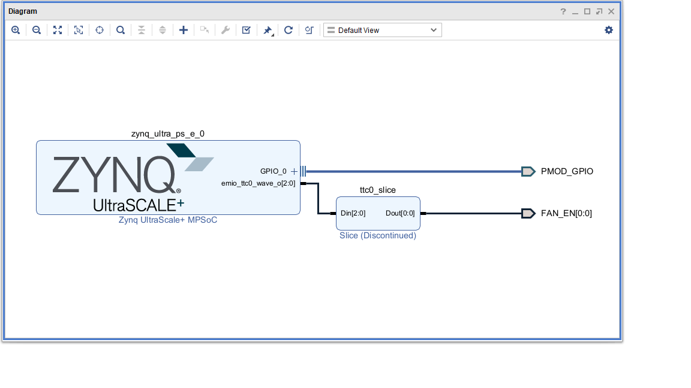

Kv260-Pmod-gpio-emio
=======================================================================

This Repository provides example for pmod-gpio(with emio) and ZynqMP-FPGA-Linux.

Overvier
------------------------------------------------------------------------------------

### Diagram



### Requirement

* Board: any of the following
  - Kv260
* OS: any of the following
  - https://github.com/ikwzm/ZynqMP-FPGA-Debian13
  
### Licensing

Distributed under the BSD 2-Clause License.

Usage
------------------------------------------------------------------------------------

### Download Kv260-Pmod-gpio-emio

```console
shell$ git clone --depth 1 --recursive https://github.com/ikwzm/Kv260-Pmod-gpio-emio
shell$ cd Kv260-Pmod-gpio-emio
```

### Program Bitstream file to PL

#### Copy Bitstream file to /lib/firmsare

```console
shell$ sudo sh -c 'gzip -d -c kv260-pmod-gpio-emio.bin.gz > /lib/firmware/kv260-pmod-gpio-emio.bin'
```

#### Compile kv260-pmod-gpio-emio.dts

```console
shell$ dtc -I dts -O dtb -o kv260-pmod-gpio-emio.dtb kv260-pmod-gpio-emio.dts
```

#### Apply dtb(device tree overlay blob)

```console
shell$ sudo mkdir /config/device-tree/overlays/kv260-pmod-gpio-emio
shell$ sudo cp kv260-pmod-gpio-emio.dtb /config/device-tree/overlays/kv260-pmod-gpio-emio/dtbo
```

### Example with gpiod

#### Install gpiod

```console
shell$ sudo apt install gpiod
```

#### Line and Pmod pin assignment

| line | Pmod Name | Pmod Pin |
|------|-----------|----------|
|  78  | S1A       | 1        |
|  79  | S2A       | 3        |
|  80  | S3A       | 5        |
|  81  | S4A       | 7        |
|  82  | S1B       | 2        |
|  83  | S2B       | 4        |
|  84  | S3B       | 6        |
|  85  | S4B       | 8        |

#### Output 0 to S1A for 2 sec

```console
shell$ sudo gpioset -c gpiochip1 -t2s,0 78=0
```

Build Bitstream file
------------------------------------------------------------------------------------

### Requirement

* Xilinx Vivado 2025.1 or 2025.1.1

### Download Kv260-Pmod-gpio-emio

```console
shell$ git clone --depth 1 --recursive https://github.com/ikwzm/Kv260-Pmod-gpio-emio
shell$ cd Kv260-Pmod-gpio-emio
```

### Build kv260-Pmod-gpio-emio.bin

#### Create Project

```
Vivado > Tools > Run Tcl Script... > fpga/create_project.tcl
```

#### Implementation

```
Vivado > Tools > Run Tcl Script... > fpga/implementation.tcl
```

#### Convert from Bitstream File to Binary File

```console
vivado% cd fpga
vivado% bootgen -image kv260-pmod-gpio-emio.bif -arch zynqmp -o ../kv260-pmod-gpio-emio.bin
vivado% cd ..
```

#### Compress kv260-pmod-gpio-emio.bin to kv260-pmod-gpio-emio.bin.gz

```console
vivado% gzip kv260-pmod-gpio-emio.bin
```

